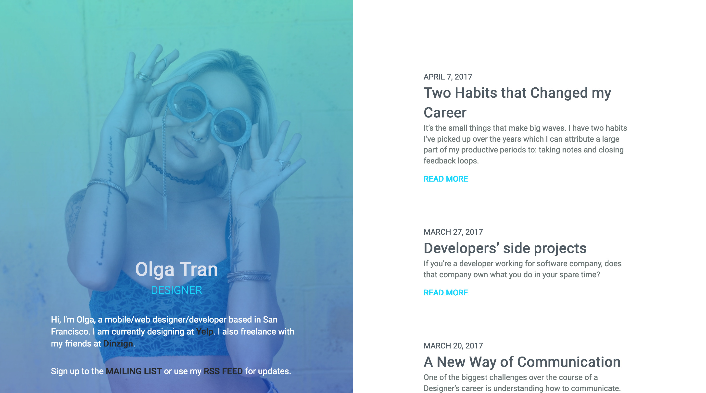

# Blog template 👩‍💻

Minimal blog template.

Utilizes vertical split screen design trend.

There are two themes available, default and blue.

## Assets

- [Girl in default theme](https://unsplash.com/photos/MA7VYLQ_9ao)
- [Girl in blue theme](https://unsplash.com/photos/_KaMTEmJnxY)
- [Roboto font](https://fonts.google.com/specimen/Roboto)

## License

This project is licensed under the MIT License - see the [LICENSE](LICENSE) file for details.
